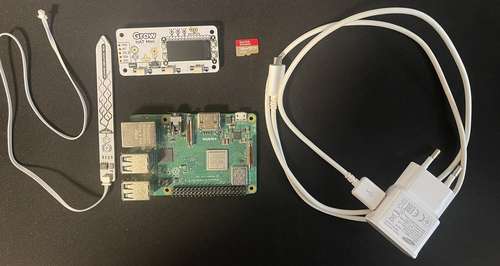
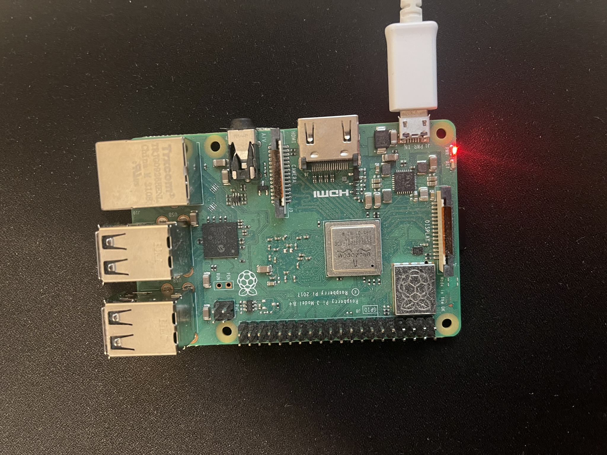
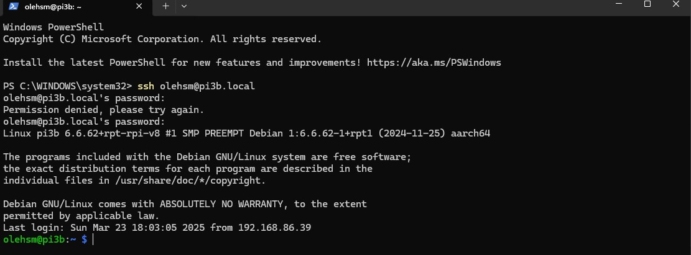
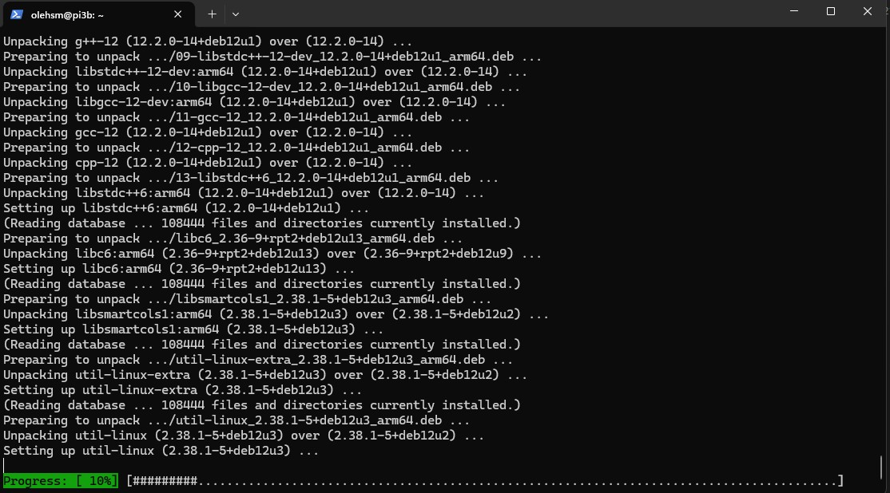
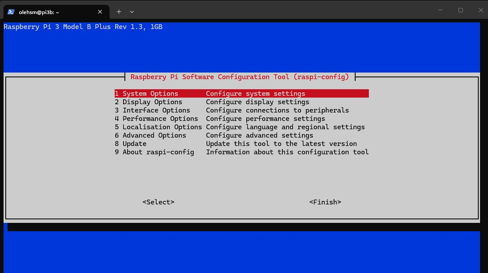
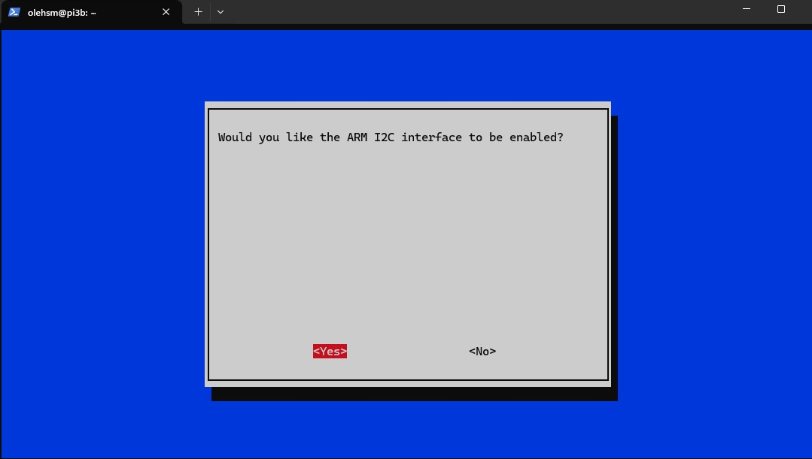
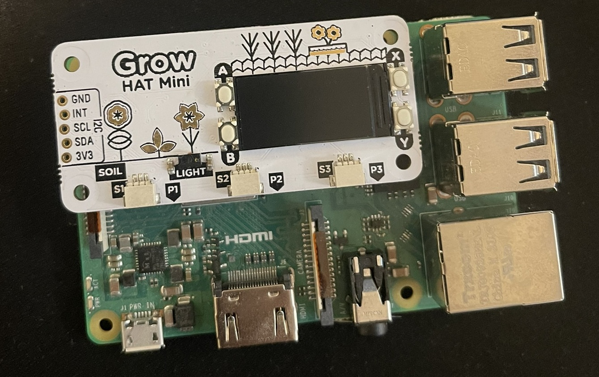

<!--more-->

> Ble litt lei av å sjekke statusen til plantene mine, så jeg forsøker å automatisere det bort.

## Ustyrsliste
* Raspberry Pi 
* Grow HAT mini
* Fuktighetssensorer
* Strømforsyning
* SD-kort

### Hva er en Grow HAT?
HAT er en forkortelse for Hard Attached on Top og kort forklart er det altså enheter som du kan utvide PI med som oftest kobles til via de 40 GPIO - pinnene på min Rasberry Pi 3. Grow HAT har en en liten LCD-skjerm som den bruker til å vise status på de 1, 2 eller 3 tilkoblede fuktighetsmålerne. Den har en høytaler som spiller av en alarm dersom fuktighetsnivået går under et fastsatt nivå (Det er altså på tide å vanne). Grow HAT kan også må lystyrke slik at det kan skapes et optimalt mijø for vekst.



## Prosjektdesign
> OBS: Pumper og kraner kan også kobles til en Grow HAT mini for å lage et helautomatisk vanninsystem for platene, slikt utstyr har ikke jeg så det blir ikke med i dette prosjektet nå.

Før jeg startet implementeringen tegnet jeg ned noen store linjer om hvordan prosjektet skulle se ut. Jeg ønsket å utvikle mest mulig i C# så jeg besteme meg for at jeg ville ha en front-end i Blazor. Den skal utvikles på lokal maskin, men hostes direkte på Rasberry Pi, i det minste i første omgang, derfor tenker jeg at Blazor Server er fin vei å gå. Sensorene leses ut med et Pythonscript og lagres i en SQLite database som også hostes direkte på Pi. 

## Oppsett av Rasberry PI
Dette prosjekter tar ikke for seg hvordan man setter opp en PI fra bunnen av, det kan du se i denne artikkelen om [Hello world fra et IoT-perspektiv](/blog/iot-hello-world/). Jeg har allerde satt opp min Rasberry PI 3 med et lettvekter operativsystem som betyr at jeg kun kan kommunisere med den via SSH (Dersom enheten er tilkoblet strøm). Det som derimot må sjekke og eventuelt endres på i konfiguasjone er hvorvidt kommunikasjon over I2C er slått på. 

### Koble til strøm og boot opp


### Koble til via SSH
Jeg bruker Powershell og kobler til via SSH. Merk at jeg endret navnet til brukeren root. I og med at jeg eier flere Rasberry Pi har jeg navngitt denne pi3b.local
```
// Koble til en enhet via SSH
ssh <brukernavn>@<maskinnavn>
```


### Oppdatere Rasberry Pi
Det er en god praksis og alltid oppdatere Pi når den startes opp etter en lang stund i dvale. Dette gjøres med noen SUDO-kommenadoer.
```
// Oppdatere Pi-OS
sudo apt update
sudo apt upgrade -y
```
Denne prosessen kan ta litt avhengig av hvor lenge det er siden det ble utført sist. Her har jeg akkurat kjørt "sudo apt upgrade -y"


Kjører en retart etter at dette er utført.

### Aktivere I2C
Dette gjøres fra det innbygde konfigurasjonsverktøyet
```
// Åpne konfigurasjonsverktøy
sudo raspi-config
```
Bildet under viser velkomstsiden til konfigurasjonsverktøyet. Velg punkt 6: "Configure advanced settings"

Velg så punktet som tar for seg i2c og trykk så aktiver.

Da er i2c-kommunikasjon aktivert og det betyr at det Raspberry Pi kan ta i mot signaler gjennom GPIO-pinnene. Det er mulig å kjøre et testoppsett på dette, men det er foreløpig ikke koblet til noe. Det er tid for å koble fra strømmen og koble til Grow HAT.
```
// Slå av Pi
sudo shutdown now
```

### Koble til Grow HAT
Sett Grow HAT på toppen av rekken med GPIO - pinner og trykk ned, pass på at pinene ikke bøyer seg eller blir ødelagt. Når det er gjort kan strømmen igjen kobles til.


Test nå kommunikasjonen med 
```
i2cdetect -y 1
```
> Om amn kjører OS-Lite som jeg gjør vil ikke dette fungere. Pakken som kreves følger ikke med ut av boksen om må legges til før bruke.

Installer pakken i2c-tools

```
// Installer i2c-tools
sudo apt update
sudo apt install -y i2c-tools
```

Når installasjonen er fullført kan man kjøre testen en gang til. Jeg fikk dette resultatet og det er positivt:
```
i2cdetect -y 1
     0  1  2  3  4  5  6  7  8  9  a  b  c  d  e  f
00:                         -- -- -- -- -- -- -- --
10: -- -- -- -- -- -- -- -- -- -- -- -- -- -- -- --
20: -- -- -- 23 -- -- -- -- -- -- -- -- -- -- -- --
30: -- -- -- -- -- -- -- -- -- -- -- -- -- -- -- --
40: -- -- -- -- -- -- -- -- -- -- -- -- -- -- -- --
50: -- -- -- -- -- -- -- -- -- -- -- -- -- -- -- --
60: -- -- -- -- -- -- -- -- -- -- -- -- -- -- -- --
70: -- -- -- -- -- -- -- --
```
Grow HAT Mini svarer på bussen på adressen 0x23
* I2C er aktivert
* HAT‑en er koblet riktig
* Pi kan kommunisere med den

> Adressen 0x23 er lyssensoren. Det gir god mening fordi fuktighetssensorene ikke er plugget i ennå.

### Installere Grow HAT software
I og med at jeg ikke har tenkt å bruke displayet, koble til pumper eller lignende, men kun skal lese av sensordata er det ikke nødvendig med hele softwarepakken fra Grow HAT, det holder med denne kommandoen:

```
sudo pip3 install growhat
```


